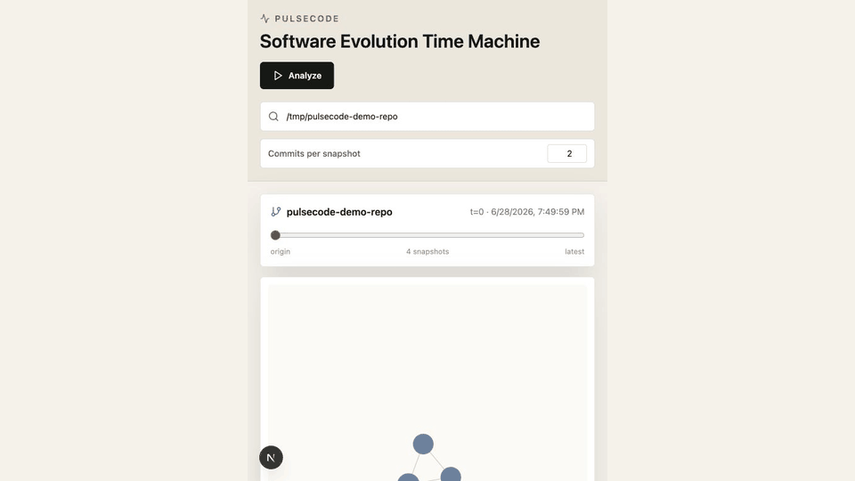
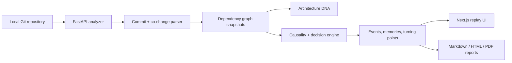

# PulseCode

PulseCode is a local-first Architecture Decision Intelligence Engine. It analyzes a Git repository, reconstructs architectural snapshots over time, and explains how the system became what it is today.

It is not a generic analytics dashboard. PulseCode is built around replay, causality, architectural DNA, event timelines, counterfactuals, and deterministic repository biography.



## Architecture



## Quick Start

Install backend dependencies:

```bash
python3 -m venv .venv
source .venv/bin/activate
pip install -r backend/requirements.txt
```

Start the API:

```bash
uvicorn backend.app.main:app --reload --port 8000
```

Install frontend dependencies and start the app:

```bash
npm install
npm run dev
```

Open `http://localhost:3000`.

## Features

- Architecture replay with play/pause, speed controls, scrubbing, event jumps, and animated dependency graph transitions.
- Architecture DNA fingerprinting for modularity, coupling, centralization, layer separation, dependency concentration, cycle pressure, and hotspots.
- Architecture causality engine that explains likely causes, confidence, supporting commits, and graph evidence.
- Architectural decisions stored independently from commits.
- Before/after time portal for structural events.
- Architectural memories, fossils, turning points, and decision influence chains.
- Counterfactual replay engine that attempts an exact Git replay without the event commits, labels approximate/failed fallbacks, adds within-repo Granger causal signal, and records corpus validation in [backend/scripts/validation_results.md](backend/scripts/validation_results.md).
- Deterministic repository biography, generated from metrics without LLMs.
- Evolution Outlook states: Stable, Growing, Accelerating, Fragmenting, Consolidating, and High Risk.
- Shareable Markdown, HTML, and PDF reports.

## Public API

Run `POST /analyze` first. It returns a `repo_id` used by the read endpoints.

| Method | Endpoint | Purpose |
| --- | --- | --- |
| `GET` | `/` | API health check |
| `GET` | `/sample-repo` | Create or return the bundled demo repository |
| `POST` | `/analyze` | Analyze a local Git repository |
| `GET` | `/timeline/{repo_id}` | Snapshot timeline metadata |
| `GET` | `/snapshot/{repo_id}/{index}` | Full graph snapshot |
| `GET` | `/events/{repo_id}` | Architectural events |
| `GET` | `/causality/{repo_id}` | Event causality and influence graph |
| `GET` | `/decisions/{repo_id}` | Architectural decisions |
| `GET` | `/decision-timeline/{repo_id}` | Decision-centric replay data |
| `GET` | `/decision-counterfactual/{repo_id}/{decision_id}` | Counterfactual for a decision |
| `GET` | `/dna/{repo_id}/{index}` | Snapshot DNA |
| `GET` | `/dna/{repo_id}/compare/{left}/{right}` | Normalized DNA comparison |
| `GET` | `/story/{repo_id}` | Repository biography and story |
| `GET` | `/family-tree/{repo_id}` | Module genealogy |
| `GET` | `/turning-points/{repo_id}` | Long-term influence ranking |
| `GET` | `/memories/{repo_id}` | Persistent architectural memories |
| `GET` | `/counterfactual/{repo_id}/{event_index}` | Event counterfactual estimate |
| `GET` | `/forecast/{repo_id}` | Evolution forecast |
| `GET` | `/health/{repo_id}` | Full health/report payload |
| `GET` | `/report/{repo_id}?format=markdown` | Markdown report payload |
| `GET` | `/report/{repo_id}?format=html` | Shareable HTML report |
| `GET` | `/report/{repo_id}?format=pdf` | Text PDF export |

Example:

```bash
curl -X POST http://localhost:8000/analyze \
  -H "Content-Type: application/json" \
  -d '{"repo_path":"/absolute/path/to/repo","snapshot_size":8}'
```

## Roadmap

- Persist analysis results across API restarts.
- Add repository-scale sampling controls for very large monorepos.
- Add richer dependency parsers for Java, Go, Rust, and JVM ecosystems.
- Add visual report screenshots to exports.
- Add CI-friendly architecture drift checks.

## Notes

PulseCode analyzes local repositories only. It does not upload source code, rewrite Git history, or use LLMs for repository biography.
